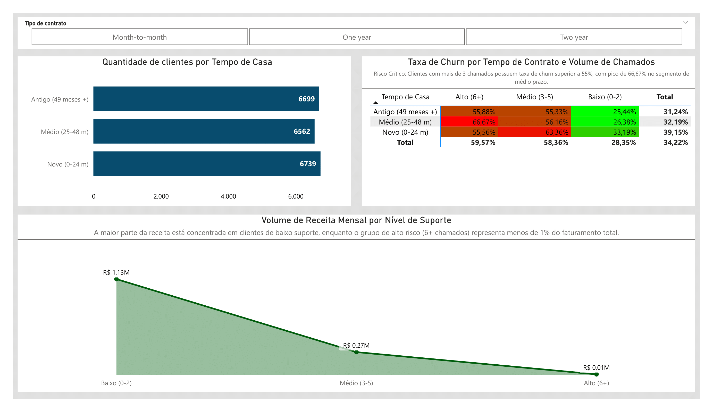

# 📊 Análise de Churn (Customer Churn Dataset)


## 🎯 Sobre o Projeto
Este projeto consiste numa análise focada na rotatividade de clientes (churn). O objetivo foi cruzar o comportamento de suporte e o tempo de permanência para identificar os reais ofensores financeiros da base de subscritores.

**💡 O Problema de Negócio:**
A empresa focava apenas na taxa de cancelamento geral, sem entender se o custo de retenção no suporte técnico estava alinhado com o faturamento de cada segmento.

**🚀 Principal Insight:**

Descobrimos o **"Paradoxo da Retenção"**:
* **O Risco Visível**: Clientes com nível **Alto de Suporte (6+ chamados)** possuem um churn crítico (acima de 60%), mas representam **menos de 1% da receita total**.
* **A Oportunidade Real**: O grupo de **Clientes Novos (0-24 meses)** detém o maior volume financeiro (R$ 1,13M), exigindo estratégias de onboarding para evitar que migrem para os níveis de suporte mais caros e instáveis.

---

## 📸 Visualização

### 📊 Dashboard Executivo


Visualização interativa focada no cruzamento de Taxa de Churn, Volume de Clientes e Impacto Financeiro.

---

## 🚀 Stack Tecnológica

* **SQL Server (T-SQL)**: ETL, Data Cleaning e Feature Engineering (Categorização de Suporte e Tenure).
* **Power BI:** Modelagem de dados, Medida DAX e UX Design.
* **Dataset:** [Customer Churn Dataset (Kaggle)](https://www.kaggle.com/datasets/sonalshinde123/customer-churn-prediction-dataset/data).

## 🔧 Destaques Técnicos

### Consulta 'categorias' criada para análise de categorias

```sql
SELECT * FROM (
    SELECT 
        CUSTOMER_ID,
        CONTRACT,
        PAYMENT_METHOD,
		
        -- Categorização do nível de suporte com base no número de chamados
        CASE 
            WHEN SUPPORT_CALLS <= 2 THEN 'Baixo (0-2)'
            WHEN SUPPORT_CALLS BETWEEN 3 AND 5 THEN 'Médio (3-5)'
            ELSE 'Alto (6+)'
        END AS NIVEL_SUPORTE,
		
        -- Regra para facilitar ordenação de nível de suporte no Power BI
        CASE 
            WHEN SUPPORT_CALLS <= 2 THEN 3
            WHEN SUPPORT_CALLS BETWEEN 3 AND 5 THEN 2
            ELSE 1 
        END AS ORDEM_SUPORTE,
		
        -- Categorização por tempo de permanência
        CASE 
            WHEN TENURE <= 24 THEN 'Novo (0-24 m)'
            WHEN TENURE BETWEEN 25 AND 48 THEN 'Médio (25-48 m)'
            ELSE 'Antigo (49 meses +)'
        END AS TEMPO_DE_CASA,
		
        -- Regra para facilitar ordenação de tempo de casa no Power BI
        CASE 
            WHEN TENURE <= 24 THEN 3
            WHEN TENURE BETWEEN 25 AND 48 THEN 2
            ELSE 1
        END AS ORDEM_TEMPO,
		
        -- Tratamento de tipo para garantir que o churn seja interpretado como número e não FALSE ou TRUE no Power BI.
        CAST(CHURN AS INT) AS CHURN
    FROM CUSTOMER
) AS CATEGORIAS
```

### Medida DAX
`Taxa Churn = DIVIDE(SUM(categorias[CHURN]), COUNT(categorias[CUSTOMER_ID]))`

**Técnicas aplicadas:**

- `CASE WHEN` para criar dimensões de análise inexistentes na base bruta.
- Criação de colunas ORDEM_SUPORTE e ORDEM_TEMPO para garantir a lógica visual no Power BI.

## 📊 Principais Resultados

### Matriz de Risco (Churn)

| Tempo de Casa | Alto (6+) | Baixo (0-2) | 
|--------|---------|----------------|
| Médio (25-48 m) | 66,67% | 26,38% |

### Impacto Financeiro por Segmento

| Nível de Suporte | Receita Mensal | Representatividade |
|--------|---------|--------------|
| Baixo (0-2) | **R$ 1,13 Milhão** | ~80% da Base |
| Alto (6+) | R$ 6.41 Mil | <1% da Base | 

## 🚀 Como Reproduzir

### Passos

**1. Clone o repositório**

```bash
git clone https://github.com/andretavaresdev/churn_analysis_dashboard.git
```

**2. Configure o banco de dados**

Execute os scripts na pasta /sql para criar a estrutura da tabela customer.

Importe os dados via SSMS (Import Flat File).

**3. Abra o Power BI**

Abra o arquivo .pbix na pasta /powerbi.

Atualize a fonte de dados para apontar para o seu servidor SQL local.

## 📂 Estrutura do Repositório

```
📦 churn-analysis-dashboard
├── 📁 sql/
│   ├── 01_transform_categories.sql
├── 📁 powerbi/
│   └── customer_churn.pbix
├── 📁 images/
│   ├── dashboard_preview.png
└── README.md
```

## 🎨 Design Principles

- **Data Storytelling** - Títulos e subtítulos que explicam o insight antes do número.
- **Consistência Visual** - Azul Marinho para volume e Verde para indicadores financeiros.
- **Interatividade** - Uso de filtros de contrato horizontais para exploração rápida.

## 🤝 Contribuições

Sugestões são bem-vindas! Abra uma Issue ou envie um Pull Request.

## 📝 Licença

CC0: Public Domain

## 👤 Autor

**André Tavares**

- LinkedIn: [andre-tavares1](https://linkedin.com/in/andre-tavares1)
- GitHub: [andretavaresdev](https://github.com/andretavaresdev)

---
